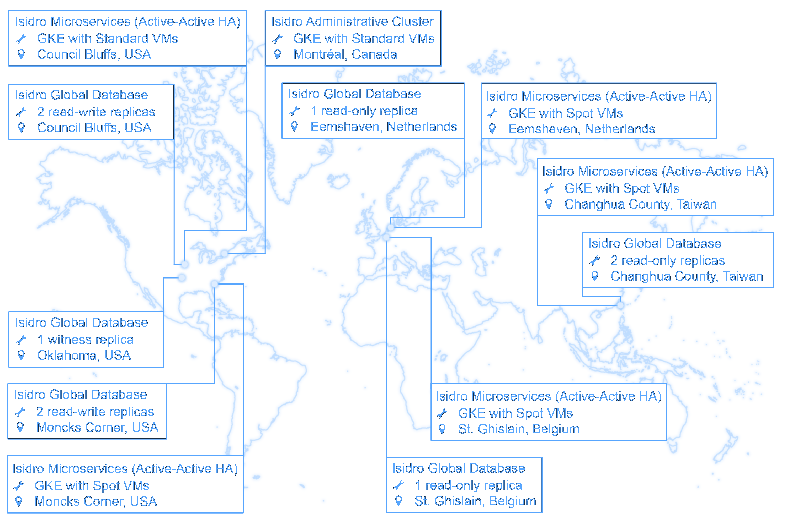

# Isidro (Chatbot)

> Isidro is an Anthos- and GKE-based microservices chatbot

Isidro includes:
* Connectors to Slack and Mattermost for event subscription and response
* Policy- and NLP-based workflow planning
* Automated execution of workflows (e.g., provisioning, deployments, and test execution)
* Automated presentation of data (e.g., deployment metrics, performance testing results, and spam trends)
* Cross-regional deployment
   * Regional workload clusters in us-central1 (Council Bluffs, Iowa) and europe-west1 (Saint-Ghislain, Belgium)
   * Regional MCI config cluster (GKE autopilot) in northamerica-northeast1 (Montreal, Canada)
* Security features like binary authorization, mTLS, workload identity, and network policies



## Prerequisites
1. APIs and features enabled on Google Cloud Platform:
    1. API: Anthos
    1. API: Anthos Service Mesh Certificate Authority
    1. API: Binary Authorization
    1. API: Cloud KMS
    1. API: Cloud Resource Manager
    1. API: GKE Hub
    1. API: Kubernetes Engine
    1. API: Multi Cluster Ingress
    1. API: Multi-Cluster Service Discovery
    1. API: Traffic Director
    ```bash
    gcloud services enable \
        anthos.googleapis.com \
        meshca.googleapis.com \
        binaryauthorization.googleapis.com \
        cloudkms.googleapis.com \
        cloudresourcemanager.googleapis.com \
        gkehub.googleapis.com \
        container.googleapis.com \
        multiclusteringress.googleapis.com \
        multiclusterservicediscovery.googleapis.com \
        trafficdirector.googleapis.com
    ```
    1. Anthos Feature: Service Mesh
1. A domain or subdomain managed through Google Cloud DNS

## System installation
_While installation is possible using non-Linux clients, it's not a well-established or documented process_

### Provision with Terraform

Set the `GOOGLE_PROJECT` and `ISIDRO_DOMAIN` environment variable, with something like:
```bash
export GOOGLE_PROJECT=example
export ISIDRO_DOMAIN=isidro.example.com
export MATTERMOST_DOMAIN=mattermost.example.com
```

Create a service account for provisioning the required resources:
```bash
gcloud iam roles create isidro_provisioner \
    --project=$GOOGLE_PROJECT \
    --file=roles/provisioner.yaml
gcloud iam service-accounts create isidro-provisioner \
    --display-name="Isidro Provisioner"
gcloud projects add-iam-policy-binding $GOOGLE_PROJECT \
    --member="serviceAccount:isidro-provisioner@$GOOGLE_PROJECT.iam.gserviceaccount.com" \
    --role="projects/$GOOGLE_PROJECT/roles/isidro_provisioner"
gcloud iam service-accounts keys create isidro-provisioner.json \
    --iam-account="isidro-provisioner@$GOOGLE_PROJECT.iam.gserviceaccount.com"
```

Navigate to the [provisioning/](provisioning/) directory, then set the `GOOGLE_APPLICATION_CREDENTIALS` environment variable, with something like:
```bash
export GOOGLE_APPLICATION_CREDENTIALS=../isidro-provisioner.json
```

Setup secondary IP ranges in the desired regions and subnets, then [run Terraform provisioning, with variable changes/overrides where required](provisioning/).  Something like:
```bash
terraform init
terraform apply \
    -var ip_range_pods_primary="isidro-primary-pods" \
    -var ip_range_services_primary="isidro-primary-services" \
    -var ip_range_pods_secondary="isidro-secondary-pods" \
    -var ip_range_services_secondary="isidro-secondary-services" \
    -var ip_range_pods_config="isidro-config-pods" \
    -var ip_range_services_config="isidro-config-services"
```

Create kubecontext configurations for the three provisioned clusters:
```bash
gcloud container clusters get-credentials isidro-us --region us-central1
gcloud container clusters get-credentials isidro-europe --region europe-west1
gcloud container clusters get-credentials isidro-config --region northamerica-northeast1
kubectl config rename-context gke_"$GOOGLE_PROJECT"_us-central1_isidro-us isidro-us
kubectl config rename-context gke_"$GOOGLE_PROJECT"_europe-west1_isidro-europe isidro-europe
kubectl config rename-context gke_"$GOOGLE_PROJECT"_northamerica-northeast1_isidro-config isidro-config
```

### Enable GMP

Enable Managed Prometheus for the US and Europe clusters:
```bash
gcloud beta container clusters update isidro-us --region us-central1 --enable-managed-prometheus
gcloud beta container clusters update isidro-europe --region europe-west1 --enable-managed-prometheus
```

## Installation

Setup a service account for building the required artifacts:
```bash
gcloud iam service-accounts create isidro-skaffold \
    --display-name="Isidro Skaffold"
gcloud projects add-iam-policy-binding $GOOGLE_PROJECT \
    --member="serviceAccount:isidro-skaffold@$GOOGLE_PROJECT.iam.gserviceaccount.com" \
    --role="roles/cloudbuild.builds.builder"
gcloud iam service-accounts keys create isidro-skaffold.json \
    --iam-account="isidro-skaffold@$GOOGLE_PROJECT.iam.gserviceaccount.com"
```

Add helm repositories:
```bash
helm repo add mattermost https://helm.mattermost.com
```

Setup skaffold files and credentials:
```bash
export GOOGLE_APPLICATION_CREDENTIALS=isidro-skaffold.json

cp skaffold.dev.yaml skaffold.yaml
cp networking/certbot.dev.yaml networking/certbot.yaml

sed -i "s/ISIDRO_DOMAIN/$ISIDRO_DOMAIN/g" networking/certbot.yaml
sed -i "s/MATTERMOST_DOMAIN/$MATTERMOST_DOMAIN/g" networking/certbot.yaml
sed -i "s/MATTERMOST_DOMAIN/$MATTERMOST_DOMAIN/g" skaffold.yaml

sed -i "s/GOOGLE_PROJECT/$GOOGLE_PROJECT/g" skaffold.yaml
sed -i "s/GOOGLE_PROJECT/$GOOGLE_PROJECT/g" networking/certbot.yaml
```

### Development environments

Make any required `skaffold.yaml` configuration changes, then run skaffold:
```bash
skaffold dev
```

### Persistent environments

Make any required `skaffold.yaml` configuration changes, then run skaffold:
```bash
skaffold run
```

To teardown:
```bash
skaffold delete
```

### DNS setup

Setup A record DNS entries for Isidro and Mattermost, using the respective Multi-Cluster Ingress IPs.

## System configuration

### Slack configuration
_Relevant if you are using Slack as your chat tool_

Create a Slack app:
1. Update the [example Slack manifest](slack/manifest.yaml) to use your Isidro endpoint
1. Create a Slack app using the application manifest
1. Consider giving the app a profile picture (e.g., the Terminator)
1. Use the verification token, under the app's "Basic Information" for Helm value `slack.verificationToken`
1. Use the OAuth token, under the app's "OAuth & Permissions" for Helm value `slack.oauthToken`

### Mattermost configuration
_Relevant if you are using Mattermost as your chat tool_

1. In the System Console, under "Integrations > Bot Accounts", "Enable Bot Account Creation"
1. In the Integrations portal, create a bot account with the name "isidro" and role "System Administrator"
    1. Consider giving the app a profile picture (e.g., the Terminator)
1. Copy the access token to the Helm values (or Skaffold overrides) as `mattermost.accessToken`
1. Add an outgoing webhook:
    1. Recommended title is "Isidro Mentions"
    1. Recommended description is "Push notification enabling the Isidro chatbot to respond to @mentions"
    1. Application type is "application/json"
    1. Trigger word is "@isidro"
    1. Callback URL is https://isidro.example.com/isidro/api/v1/submit (replace isidro.example.com with your Isidro domain)
    1. Leave the remaining values as the defaults
1. Copy the verification token to the Helm values (or Skaffold overrides) as `mattermost.verificationToken`
1. Upgrade the Helm installation

### GitHub Actions
_Relevant if you are triggering GitHub Actions workflows with the chatbot_

Create a personal access token, which includes `repo`, `workflow`, and `packages` permissions.  Use the token for the Helm value `deployer.github.token`.

## Usage

Mention @isidro in Slack messages, and get a response.  Use separate message threads for separate chatbot conversations.

### Test payload
```bash
curl -X POST https://isidro.example.com/api/v1/submit \
    -H "Content-Type: application/json" \
    -d '{"token": "1234567890", "event": {"channel": "quality", "ts": "1234567890", "user": "me", "text": "Hello"}}'
```